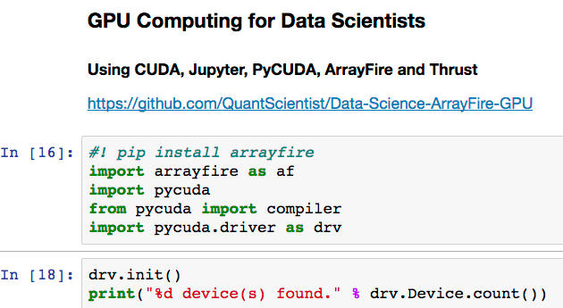

# All-in-one Jupyter Docker image for GPU Deep Learning using PyCUDA, ArrayFire, CUDA etc. 

NOTE: Building this image may take several hours since CMAKE is being built from source. 
https://github.com/QuantScientist/deep-ml-meetups

This repository includes utilities to build and run my NVIDIA Docker image for the Deep Learning School:
https://www.meetup.com/TensorFlow-Tel-Aviv/events/241762893/

Please be aware that this project is currently **experimental**.

### CUDA requirements

Running a CUDA container requires a machine with at least one CUDA-capable GPU and a driver compatible with the CUDA toolkit version you are using.

NVIDIA drivers are **backward-compatible** with CUDA toolkits versions:

CUDA toolkit version   | Minimum driver version
:---------------------:|:-----------------------:
  7.0                  | >= 346.46
  7.5                  | >= 352.39
  
** We use CUDA 8.0. **   

Get the toolkit:
`sudo apt-get install nvidia-cuda-toolkit`

Get nsight IDE:
`sudo apt-get install nvidia-nsight`

# Image contents
On top of all the fancy deep learning libraries, this docker image contains:

Ubuntu 16.04
CUDA 8.0 (GPU version only)
cuDNN v5 (GPU version only)
Tensorflow
Theano
Keras
iPython/Jupyter Notebook
Numpy, SciPy, Pandas, Scikit Learn, Matplotlib
A few common libraries used for deep learning

* ArrayFire
* PyCUDA
* Python 
* LLVM
* LLDB
* Snappy
* Numba
 
# Build the image

docker build -t quantscientist/gpu -f Dockerfile.cpu .

# Run the image
docker run -it -p 5555:5555 -p 7842:7842 -p 8787:8787 -p 8786:8786 -p 8788:8788 -v /myhome/data-science/:/root/sharedfolder  --env="DISPLAY"  --env="QT_X11_NO_MITSHM=1"  --volume="/tmp/.X11-unix:/tmp/.X11-unix:rw"  quantscientist/gpu bash

# Run Jupyter
chmod +x run_jupyter.sh
./run_jupyter.sh

OR

docker build -t quantscientist/gpu -f Dockerfile.gpu .

# Issues and Contributing
* Please let us know by [filing a new issue](https://github.com/QuantScientist/Data-Science-ArrayFire-GPU/issues/new)
* You can contribute by opening a [pull request](https://help.github.com/articles/using-pull-requests/)  
You will need to send a signed copy of the [Contributor License Agreement](CLA) to digits@nvidia.com before your change can be accepted.
